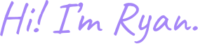

  

  

 

  📫 <a href="mailto:ryan@ryantzw.dev">Email</a> •
  🌐 <a href="https://ryantzw.dev">Portfolio</a> •
  <a href="https://linkedin.com/in/ryan-tzw">LinkedIn</a>

  

<!--- Logos --->

    
    
    
    
    
    

